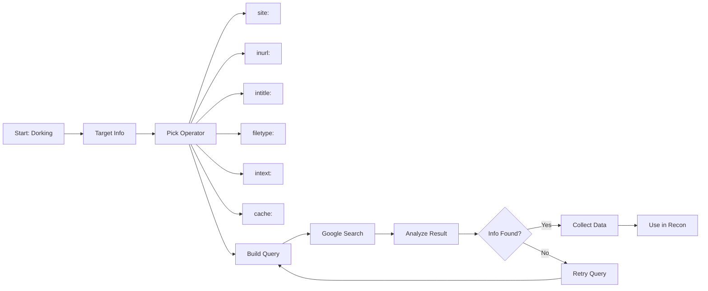

## 🧠 Google Dorks – Exploit Search Techniques

These advanced **Google search queries** (aka *Google Dorks*) are used to find **exposed files**, **leaked credentials**, **open directories**, **subdomains**, and other juicy info that shouldn't be public. These are widely used in **ethical hacking**, **bug bounty**, and **OSINT** operations.

> 📚 Source: [Exploit-DB Google Hacking Database (GHDB)](https://www.exploit-db.com/google-hacking-database)

---

---
### 🔐 1. **Exposed Credentials & Secrets**

These dorks target common configuration and secrets files that may contain sensitive credentials:

#### 🔸 `.env` Files – API Keys, DB Passwords, etc.

```dork
inurl:.env DB_PASSWORD
```

#### 🔸 JSON Files – API Keys in Code

```dork
filetype:json intext:api_key
```

#### 🔸 `.ini` Configuration Files – Database Info

```dork
filetype:ini intext:db_user
```

#### 🔸 YAML Config Files – Passwords in Plaintext

```dork
filetype:yaml intext:password
```

#### 🔸 AWS Keys in Code Repositories or Docs

```dork
intext:"AWS_SECRET_ACCESS_KEY"
```

---

Let me know if you're ready for the **next category** — like:

* 📁 *Exposed Directories & File Listings*
* 🌐 *Subdomain Discovery & Dev Environments*
* 🔓 *Admin Panels & Login Portals*
* 🔍 *Sensitive Documents (PDF, XLS, CSV leaks)*

