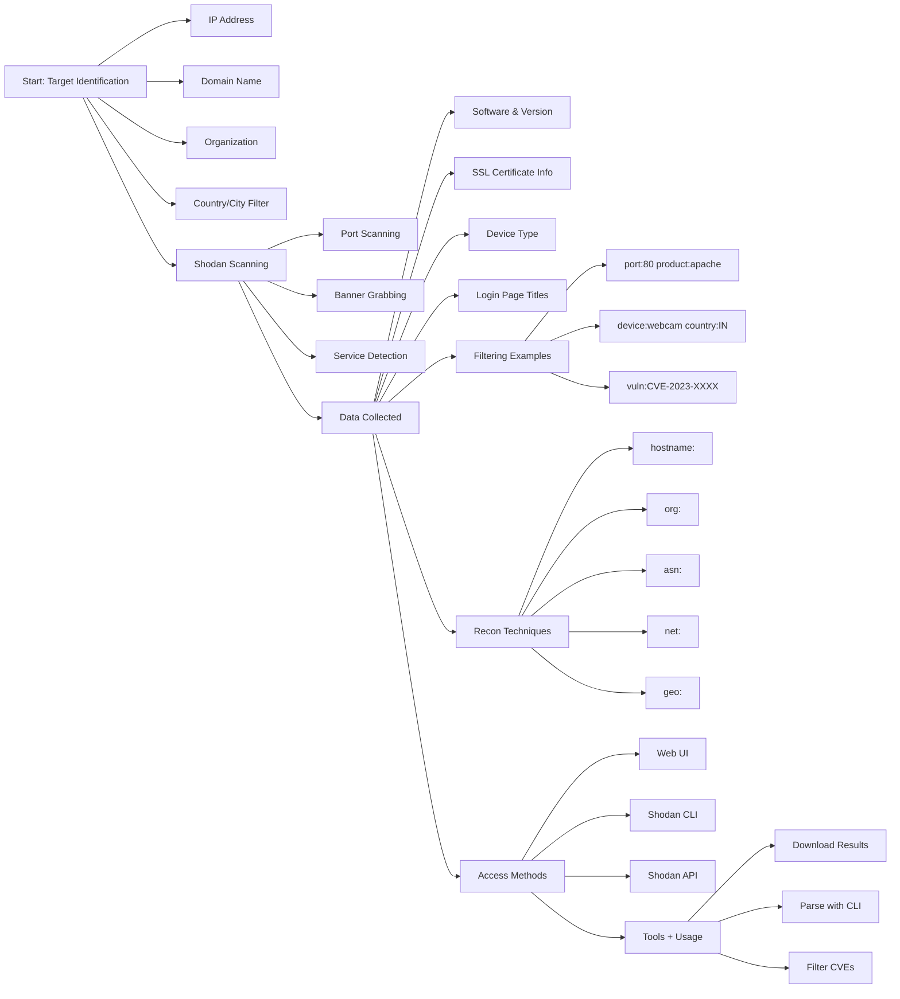

# 🛰️ **Shodan-Recon**

## **Shodan Recon Overview**

**Shodan** is a search engine for internet-connected devices. It’s widely used in cybersecurity for:

* Reconnaissance
* Identifying exposed systems & services
* Mapping attack surfaces
* Finding potential vulnerabilities

---

### 🌐 Useful Links:

* 🔗 Website: [https://www.shodan.io](https://www.shodan.io)
* 📚 Filter Reference: [https://www.shodan.io/search/filters](https://www.shodan.io/search/filters)

---
## ⚙️ How Shodan Works


---
## ⚙️ How Shodan Works

### 1. **Global Internet Scanning**

Shodan uses a vast network of scanners to connect to **every public IPv4 address** and **interacts with open ports**, acting like a **banner grabber**.

🔍 For example:

* Connects to `x.x.x.x:80` → saves HTTP headers
* Connects to `x.x.x.x:21` → saves FTP banner

---

### 2. **Banner Collection**

When Shodan connects to a service, it collects exposed **banners/metadata** such as:

* Software name & version (e.g., Apache 2.4.7)
* OS type & version
* SSL certificate details
* Web server headers
* Auth methods
* Error messages
* Custom HTML titles/messages

---

### 3. **Indexing and Tagging**

Collected data is indexed and **tagged based on**:

* `port:` (e.g., `port:80`)
* `product:` (e.g., `product:"Apache"`)
* `org:` (e.g., `org:"Airtel"`)
* `country:` (e.g., `country:US`)
* `vuln:` (e.g., `vuln:CVE-2023-12345`)
* `ssl:` fields
* `http.component:` (e.g., `http.component:"WordPress"`)

---

### 4. **Vulnerability Matching**

Shodan matches banners with **known CVEs** using:

* National Vulnerability Database (NVD)
* Internal vulnerability signature sets

If matched, the system flags it as:
`vuln:CVE-XXXX-XXXX`

---

### 5. **User Interfaces + API Access**

You can access Shodan via:

* 🌐 Web UI: [https://www.shodan.io](https://www.shodan.io)
* 💻 Shodan CLI
* 🔑 Shodan API
* 🔌 Integrations with red team tools & threat intel platforms

---

## 📊 Summary Table

| Stage       | Description                                      |
| ----------- | ------------------------------------------------ |
| Scanning    | Shodan probes IPs and ports like a port scanner  |
| Banner Grab | Collects banner/response data from open services |
| Parsing     | Extracts product, version, OS, etc.              |
| Indexing    | Tags with location, org, protocol, etc.          |
| CVE Mapping | Matches services with known vulnerabilities      |
| Access      | Web, CLI, and API for searching and automation   |

---

## 🔐 Account Setup

1. Register on [Shodan](https://www.shodan.io).
2. Visit your [profile](https://account.shodan.io) to get your **API Key**.

---

## 🔍 Basic Search Usage

```
apache
ftp
wordpress
nginx
cisco ios
```

---

## 🎯 Using Filters to Narrow Results

```sh
apache port:80 country:US
```

---

## 🔎 Filter Reference

### 🔢 port: — Search by Open Port

```sh
port:80
port:443
port:22
port:21
```

🧪 **Examples:**

```sh
port:80 apache
device:webcam port:554
```

---

### 🔧 product: — Search by Specific Service/Product

```sh
product:"apache"
product:"apache tomcat"
product:"Remote Desktop Protocol"
product:"LiteSpeed httpd"
```

---

### 🔗 Combined Filters

```sh
port:8080 product:"Apache Tomcat"
```

---

### 🌐 http.component: — Web Technologies

```sh
http.component:"WordPress"
http.component:"PHP"
http.component:"MySQL"
http.component:"Yoast SEO"
```

---

### 🔍 `http.component` / `http.status` / `version`

```sh
http.component:"wordpress" http.status:200
http.component:"wordpress" version:"6.2"
```

---

### 🛰️ `asn:` – Filter by ASN

```sh
asn:AS26560
asn:AS526560
```

#### 🔗 Useful ASN Lookup Tools:

* 🌐 [https://asnlookup.com](https://asnlookup.com)
* 🌐 [https://hackertarget.com/as-ip-lookup/](https://hackertarget.com/as-ip-lookup/)
* 🌐 [https://bgp.he.net/](https://bgp.he.net/)

---

### 🌐 `net:` – Filter by IP Range / CIDR

```sh
net:8.8.8.0/24
net:103.86.99.0/24
```

---

### 🔤 `hostname:` – Filter by Hostname

```sh
hostname:tesla.com
hostname:*.gov
```

---

### 💽 `os:` – Operating System Filter

```sh
os:"Windows Server 2012"
os:"Ubuntu" port:22
```

---

### 🌍 `country:` / `city:` – Geo Filter

```sh
country:IN
country:IN city:Mumbai
```

---

### 📍 `geo:` – Latitude / Longitude

```sh
geo:"32.800900,-117.000900"
```

---

### 🏢 `org:` – Organization Filter

```sh
org:"Google"
org:"HATHWAY CABLE AND DATACOM LIMITED"
```

---

### 🧾 `title:` – Match HTML `<title>` Tag

```sh
title:"Apache Tomcat/9.0.97"
title:"armour"
```

---

### 🖥️ `has_screenshot:` – Remote Desktop / Web UI Screenshot

```sh
port:3389 has_screenshot:true
product:"Remote Desktop Protocol"
```

---

### 🔒 `ssl:` – SSL/TLS Certificate Info

```sh
ssl:"Yum Brands Inc."
ssl.cert.subject.cn:"*.pizzahut.com"
```

---

### 🔐 `vuln:` – CVE Search (Known Vulnerabilities)

```sh
vuln:CVE-2019-19781 country:DE
vuln:CVE-2024-52318 hostname:tesla.com
```

---

### ⏰ `before:` / `after:` – Time of Index

```sh
after:"2024-01-01"
before:"2025-01-01"
```

---

### 📷 `device:` – Filter by Device Type

```sh
device:webcam
```

---

### 🧠 `tag:` – ICS / SCADA / PLC Systems

```sh
tag:ics
tag:scada
tag:plc
```

---

### 🔑 `hash:` – Match by Banner Hash

```sh
hash:-1761231231
```

---

## ✅ BONUS: Useful Tools for Recon & Enrichment

| Tool                     | Link                                                                     |
| ------------------------ | ------------------------------------------------------------------------ |
| 🔎 ASN Lookup            | [https://asnlookup.com](https://asnlookup.com)                           |
| 🌐 HackerTarget IP Tools | [https://hackertarget.com/ip-tools/](https://hackertarget.com/ip-tools/) |
| 📊 BGP Routes & ASN      | [https://bgp.he.net/](https://bgp.he.net/)                               |
| 🌍 IP Geolocation        | [https://ipinfo.io/](https://ipinfo.io/)                                 |
| 🕵️‍♂️ Shodan Search     | [https://www.shodan.io/](https://www.shodan.io/)                         |

---


## 🔍 **API Usage Sample (Python)**

```python
import shodan

API_KEY = 'YOUR_API_KEY'
api = shodan.Shodan(API_KEY)

results = api.search('apache country:IN')

for result in results['matches']:
    print(f"IP: {result['ip_str']} | Org: {result.get('org')}")
```

---

## 🛠️ **Tips for Pentesters**

* Combine filters like:
  `product:apache port:80 country:IN`

* Use:
  `has_screenshot:true` → for RDP/Web UI screenshots

* Search for known CVEs using:
  `vuln:CVE-XXXX-XXXX`

* Use CIDR/ASN to explore specific networks:
  `net:192.168.1.0/24` or `asn:AS12345`

* Extract domains with:
  `hostname:"*.example.com"`

---

## 💻 **Shodan CLI Guide**

The Shodan CLI allows you to use Shodan search from the terminal.

---

### 1. ✅ Installation

```bash
pip install shodan
```

---

### 2. 🔑 Initialize with Your API Key

```bash
shodan init YOUR_API_KEY
```

**Example:**

```bash
shodan init VWikQRjORSleIJquCKkaRqKHWAOQPp
```

(This stores your API key locally.)

---

### 3. 🔍 Search

```bash
shodan search "title:'Apache Tomcat/9.0.97'"
```

---

### 4. 💾 Download Results

```bash
shodan download apache-tomcat "title:'Apache Tomcat/9.0.97'" --limit 10
```

(This saves results in a compressed `.json.gz` format.)

---

### 5. 🧾 Convert Results to JSON

```bash
shodan parse --fields ip_str,port,org,hostnames apache-tomcat.json.gz
```

**Optional Fields:**

* `ip_str`
* `port`
* `org`
* `hostnames`
* `location.city`
* `ssl.cert.subject.cn`
* `vulns`

---

### 6. ⚙️ Additional Useful Commands

| Function                  | Command                          |
| ------------------------- | -------------------------------- |
| Show Help                 | `shodan --help`                  |
| Account Info              | `shodan info`                    |
| Host Lookup               | `shodan host <IP>`               |
| Example                   | `shodan host 8.8.8.8`            |
| Scan IP/Range (Paid Plan) | `shodan scan submit <IP>`        |
| Example                   | `shodan scan submit 192.168.1.1` |

---

📖 Reference: Notes inspired by guidance from Mr. Sachin Verma ([Armour Infosec](https://www.armourinfosec.com/)) and enriched with further improvements and updates.


