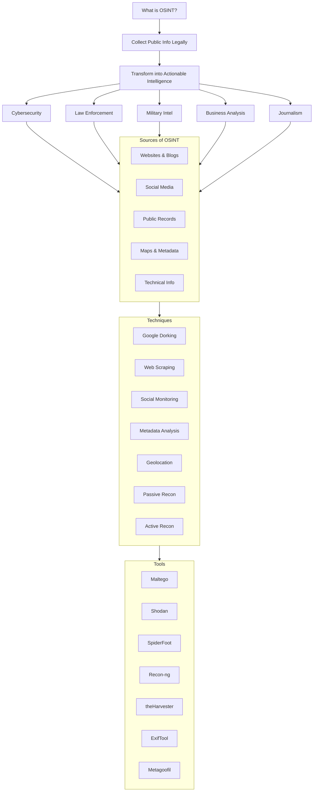

# 🧠 Open-Source Intelligence (OSINT)

### 🔍 What is OSINT?

**Open-Source Intelligence (OSINT)** is the process of **collecting, analyzing, and transforming publicly available information into actionable intelligence**.
It involves data collection from sources like websites, social media, public records, and news platforms — **without hacking or unauthorized access**.

---

### 🎯 OSINT is Widely Used In:

* 🛡️ **Cybersecurity** – Threat hunting, breach detection, recon
* 👮 **Law Enforcement** – Tracking suspects, gathering digital evidence
* 🪖 **Military Intelligence** – Monitoring adversaries and geopolitical activities
* 🧑‍💼 **Business Intelligence** – Market research, competitor analysis
* 🗞️ **Investigative Journalism** – Fact-checking and uncovering stories
* 🧠 **Threat Hunting** – Identifying cybercriminal behavior and infrastructure

---

### 🧩 Key Components of OSINT

#### 📡 Sources of OSINT:

* 🌐 **Internet:** Blogs, websites, forums, company portals
* 📱 **Social Media:** Twitter, Instagram, Telegram, Facebook, LinkedIn
* 🧾 **Public Records:** Government databases, court records, business registries
* 📰 **News & Media:** News portals, TV, radio broadcasts
* 🎓 **Academic Data:** Research papers, journals, patents
* 🌍 **Geospatial Data:** Satellite imagery, Google Maps, OpenStreetMap, GPS metadata
* 💻 **Technical Info:** WHOIS, DNS, IP data, open ports, exposed devices

---

### 🧪 Common OSINT Techniques

* 🕷️ **Web Scraping:** Automate data extraction from websites
* 📲 **Social Media Monitoring:** Track posts, mentions, hashtags
* 🧠 **Google Dorking:** Advanced Google search to find hidden/sensitive info
* 🧾 **Metadata Analysis:** Extract EXIF, PDF, DOC metadata
* 📍 **Geolocation:** Trace location via image data or post coordinates
* 👣 **Passive Footprinting:** Collect data **without** touching the target
* 🧪 **Active Footprinting:** Interact with the target (e.g., ping, port scans)

---

### 🛠️ Popular OSINT Tools

| Tool                | Purpose                                     |
| ------------------- | ------------------------------------------- |
| **Maltego**         | Link analysis & entity relationship mapping |
| **Shodan**          | Search engine for IoT and exposed devices   |
| **SpiderFoot**      | Automated OSINT tool (domains, emails, IPs) |
| **Recon-ng**        | Recon framework for web-based targets       |
| **TheHarvester**    | Gather emails, domains, subdomains          |
| **Google Dorks**    | Use Google search operators for deep data   |
| **Metagoofil**      | Metadata extraction from docs               |
| **FOCA**            | Discover hidden info & metadata in files    |
| **ExifTool**        | Read and edit EXIF metadata in images/files |
| **OSINT Framework** | Directory of categorized OSINT tools        |

📎 Visit: [https://osintframework.com/](https://osintframework.com/)

---

### 📌 Applications of OSINT

* 🔐 **Cybersecurity:** Detect breaches, gather threat intel, monitor leaks
* 🕵️ **Law Enforcement:** Investigate suspects, monitor criminal activity
* 🏢 **Corporate Intelligence:** Competitor analysis, fraud detection, HR background checks
* 🪖 **Military:** Track troop movement, gather situational awareness
* 📰 **Journalism:** Verify sources, conduct investigations

---

### ⚖️ Legal & Ethical Considerations

✅ Use **only** data that is publicly available
❌ Do **NOT** hack, trespass, or violate privacy laws
📜 Respect data protection regulations like **GDPR**, **HIPAA**, etc.
🚫 Misuse (e.g., stalking, harassment, or cybercrime) is **illegal**

---

### 🔁 Example OSINT Workflow

1. **Domain/IP Recon:**

   * Use WHOIS, DNS records, reverse lookup
2. **Social Media Analysis:**

   * Analyze profiles, posts, comments, geotags
3. **Metadata Extraction:**

   * Pull hidden data from images, PDFs, DOCs
4. **Technical Scanning:**

   * Use Shodan to find exposed cameras/devices
5. **Data Correlation:**

   * Cross-link info for building intelligence profiles
6. **Reporting:**

   * Document findings with evidence, screenshots, and summaries

---

---

📖 Reference: Notes inspired by guidance from Mr. Sachin Verma Sir ([Armour Infosec](https://www.armourinfosec.com/)) and enriched with further improvements and updates
