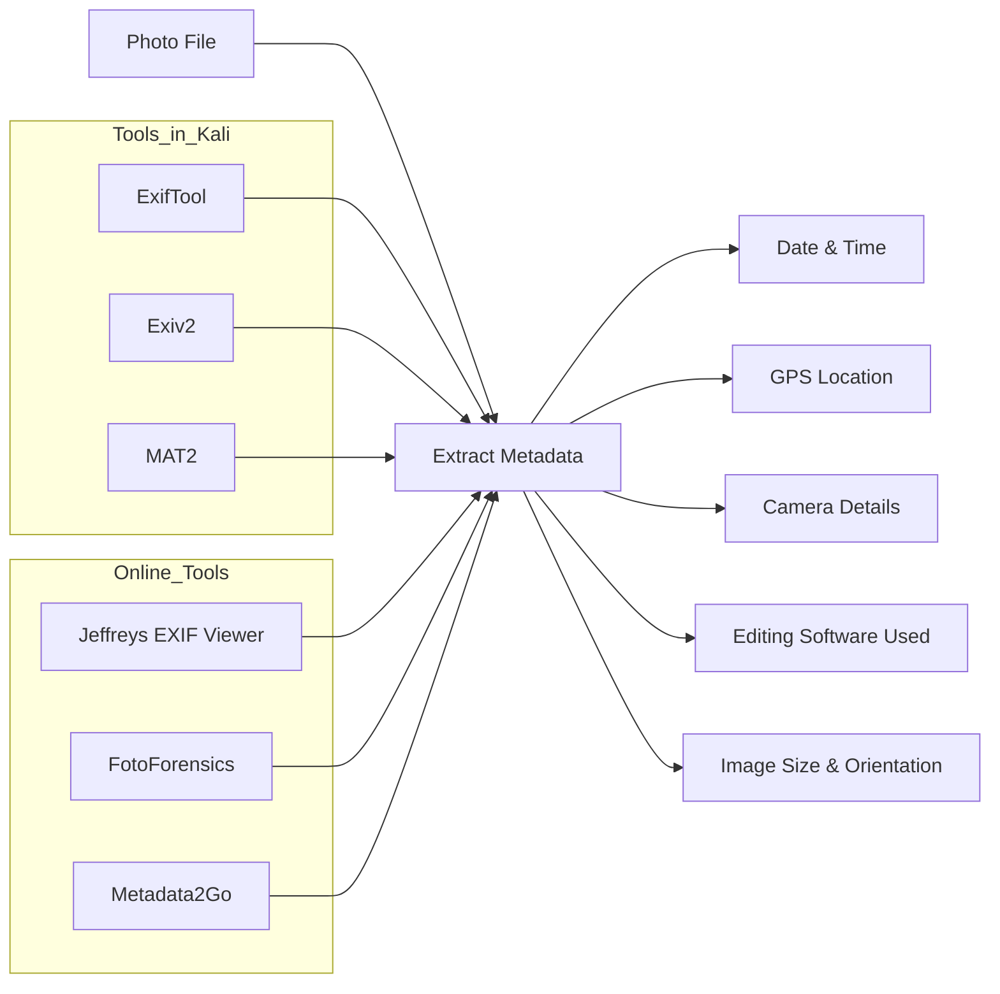

# 🔥 Image Metadata 

## 🖼️ What is Image Metadata?

**Image Metadata** is hidden data embedded in image files that contains info about:

* 📆 **When** the photo was taken
* 📍 **Where** it was taken (GPS)
* 📷 **How** it was taken (camera settings)
* 🧑‍💻 **Who** created or edited it

---


---

## 📂 Types of Image Metadata

| Type            | Description                                                                                          |
| --------------- | ---------------------------------------------------------------------------------------------------- |
| **EXIF**        | Automatically generated by cameras. Includes: date/time, GPS, camera model, ISO, shutter speed, etc. |
| **IPTC**        | Editorial/press metadata: captions, keywords, copyright, creator details.                            |
| **XMP**         | Adobe-standard metadata for edits, tags, ownership info.                                             |
| **File System** | OS-level metadata like file name, size, created/modified dates, and permissions.                     |

---

## 📋 Common Data Stored

* Date/time taken
* GPS (lat, long, altitude)
* Camera info: make/model, ISO, aperture, shutter speed
* Software used for editing
* Author info & copyright
* Device IDs (sometimes)

---

## ❗ Why It Matters

| Purpose                  | Use Case                              |
| ------------------------ | ------------------------------------- |
| 🔎 **Forensics & OSINT** | Reveal GPS, timestamps, device info   |
| 🛡️ **Privacy Risks**    | Exposes location/home unintentionally |
| 👨‍⚖️ **Legal Proof**    | Proves authorship or authenticity     |
| 💻 **Digital Evidence**  | Cybercrime, courtroom, threat intel   |

---

## 🌐 Free Tools to Analyze Metadata

### 🔗 Online Tools

#### 1. [Raw.pics.io](https://raw.pics.io/photo-metadata-viewer/)

* View EXIF, IPTC, XMP
* Shows camera settings & GPS (if available)
* Supports JPG, PNG, RAW, etc.

#### 2. [Pic2Map](https://www.pic2map.com)

* Extracts & maps GPS from photos
* Useful for OSINT, photo mapping

#### 3. [exif](https://exif.tools/)
#### 4. [Fotoforensics](https://fotoforensics.com)
---

## 🧰 CLI Tools on Kali Linux

### 1️⃣ ExifTool (Most Powerful)

```bash
apt update
apt install libimage-exiftool-perl
```

**Usage:**

```bash
exiftool image.jpg
```

**Remove Metadata:**

```bash
exiftool -all= image.jpg
```

---

### 2️⃣ Exif (Simple JPEG Tool)

```bash
apt install exif
exif image.jpg
```

⚠️ Only works with `.jpg` or `.jpeg` files

---

### 3️⃣ Strings (Manual Extraction)

```bash
strings image.jpg | less
```

✅ Can expose hidden strings (EXIF or injected)

---

## 🖥️ GUI Tool — MAT2

### 4️⃣ Metadata Cleaner (MAT2 GUI)

```bash
apt install mat2
mat2 --gui
```

**CLI Usage:**

```bash
mat2 image.jpg
mat2 --check image.jpg
```

---

## 🧠 Use Cases

* 👮‍♂️ Digital Forensics
* 🕵️‍♀️ OSINT Investigations
* 🛡️ Cybersecurity Incident Response
* 🧼 Privacy Sanitation (removing metadata)

---

## 📐 Convert GPS (DMS to Decimal) — Python Snippet

### ✅ Code:

```python
def dms_to_decimal(deg, minutes, seconds):
    return deg + (minutes / 60) + (seconds / 3600)

lat = dms_to_decimal(28, 36, 33.13)
lon = dms_to_decimal(77, 14, 34.01)

print(f'Latitude: {lat}')
print(f'Longitude: {lon}')
print(f"Google Maps: https://www.google.com/maps/search/?api=1&query={lat},{lon}")
```

---

### ⚙️ How to Save & Run on Linux/Kali/Termux:

#### 📄 Step 1: Save the script

```bash
nano gps_converter.py
```

Paste the code above. Then:

* Press `Ctrl + O` → Enter to save
* Press `Ctrl + X` to exit

#### ▶️ Step 2: Run the script

```bash
python3 gps_converter.py
```

✅ Output:

```
Latitude: 28.60920277777778
Longitude: 77.24278055555556
Google Maps: https://www.google.com/maps/search/?api=1&query=28.60920277777778,77.24278055555556
```

🗺️ You can copy-paste the link in your browser to see the exact location on Google Maps.

---


📖 Reference: Notes inspired by guidance from Mr. Sachin Verma Sir ([Armour Infosec](https://www.armourinfosec.com/)) and enriched with further improvements and updates
